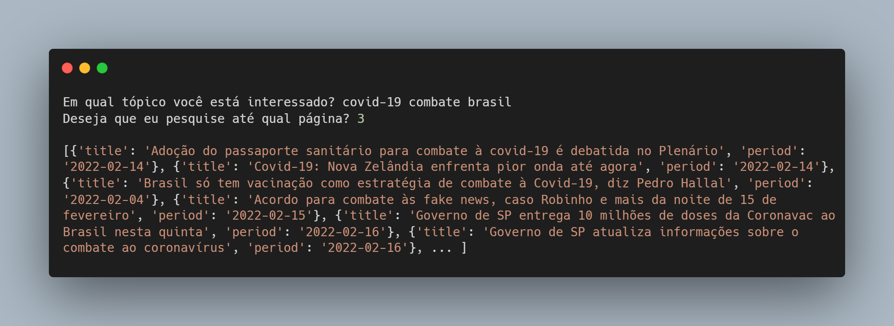

# Tendência de um tópico

A ideia principal é *Em uma pesquisa rápida, quantas vezes se mencionou o tópico citado nos últimos x dias?*

### Regras de negócio

[ x ] Caso nenhuma palavra chave do tópico esteja no título da notícia, ela não será considerada
